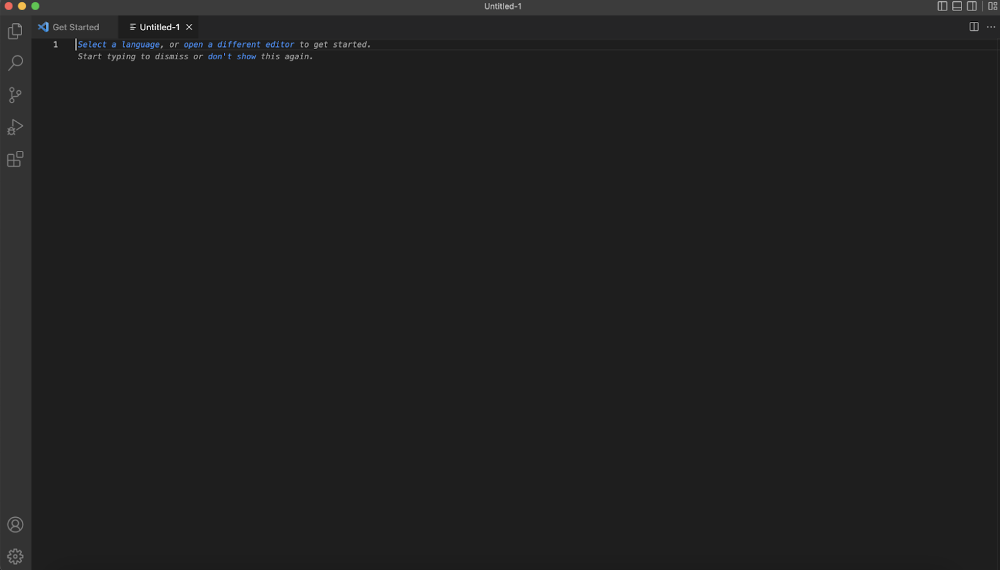
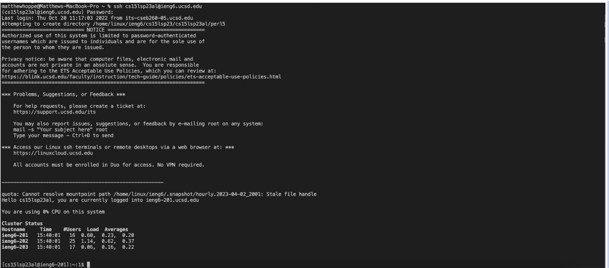
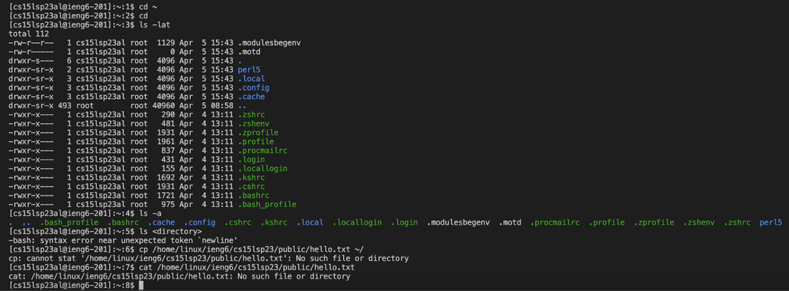

# Tutorial for Remote Access

## Install VScode

1. Go to the vs code website.
2. Find the download suited for your computer.
3. Download vs code and open it to make sure it works, after opening it you should see a screen similar to the picture above.

## Connect to the Server

1. If you are on Windows, install git if you don't have it, then set your terminal to use git bash.
2. Open a terminal and use `ssh cs15lsp23zz@ieng6.ucsd.edu` with the `'zz'` replaced with your usernames characters.
3. If this is your first time connecting, type yes when the prompt comes up then enter your password, press enter after each one.

## Try Commands 

1. In the terminal, after you have connected, run some commands. 
2. Run the following commands:
 - `cd ~` - changes the directory to the home directory,  changed it to home directory
 - `cd ` - changes the directory, didn't change it again
 - `ls` - list all the folders/files in a path
 - `ls -lat` - list all the folders in a path, , listed a lot of files selected for with '-lat'
 - `ls -a` - same as above but for files selected for with '-a'
 - `cat` - prints the contents of the file(s) given, there was no such file so nothing printed
 - `pwd ` - displays the working directory
 - `mkdir` - makes a new directory
 - `cp ` - copies the files
3. Note what happens and if any errors come up. To log out use the command `exit` or `ctrl/cmd d`.

