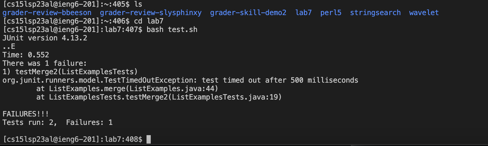
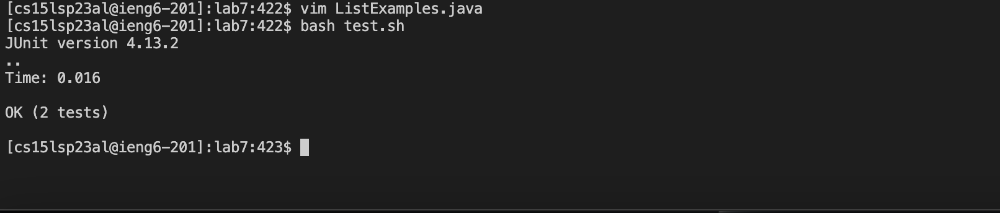

# All about ```grep```

Note: All references to strings also indicate patterns if patterns not already indicated

## Interesting Option 1: ```grep -x pattern file(s)```
Source: [wikibooks](https://en.wikibooks.org/wiki/Grep)
Source: [ChatGPT](https://openai.com/blog/chatgpt)

The grep -x command is used to search for an exact match of a given input string/pattern. If a line in the file matches completely, then that line is output.

Example 1:
The command below searches the ```chapter-1.txt``` file for lines that exactly match the string "INSIDE THE FOUR FLIGHTS". All exact matches
are the output as seen below. This command is useful as shown below for checking if text that should be in a file is actually there.

Input:
```
grep -x "INSIDE THE FOUR FLIGHTS" ./technical/911report/chapter-1.txt
```

Output:
```
INSIDE THE FOUR FLIGHTS
```


Example 2:
The command below searches the ```commission_report.txt``` file for lines that exactly match the string "LEGAL SERVICES CORPORATION". All exact matches are then output as seen below. This command is useful as shown below if you want to see if a file contains an exact copy of a string, if you for example already know what should be in a file and want to make sure that it is actually there, you could use this command to check.

Input:
```
grep -x "LEGAL SERVICES CORPORATION" ./technical/government/About_LSC/commission_report.txt
```

Output:
```
LEGAL SERVICES CORPORATION
```


## Interesting Option 2: ```grep -e pattern file(s)``` or ```grep -e pattern1 -e pattern2 file(s)```
Source: [wikibooks](https://en.wikibooks.org/wiki/Grep)
Source: [ChatGPT](https://openai.com/blog/chatgpt)

The grep -e command is used to search for a pattern or regular expression in a given input. The -e option allows you to specify the pattern or regular expression directly on the command line. It is especially useful if the pattern has special characters, or starts with a hyphen (-) because this could be interpreted as an option by grep otherwise. You can also use -e to search for multiple patterns by chaining it together.

Example 1:
The command below searches the file ```1468-6708-3-1.txt``` for the string "year", then all lines in that file that contain the string "year" are output. This can be seen in the output below. This command is usefuls as shown below if you want to search for a string that starts with a hyphen (-) because otherwise the hyphen may be mistaken as an option.

Input:
```
grep -e -year ./technical/biomed/1468-6708-3-1.txt
```

Output:
```
to quality-adjusted life-years, healthy year equivalents,
. That article showed that estimated 4-year YOL and YHL
primary analysis we used observed 7-year YOL and YHL when
they were available, and observed 3-year YOL and YHL plus
4-year estimated YOL and YHL when they were not (about
about 93 women per treatment arm, if 7-year YHL were the
These results are for a 7-year follow-up. The relative
```


Example 2:
The command below searches the file ```journal.pbio.0020001.txt``` for the strings "climate" and "biodiversity". All lines in the file that contain both "climate" and "biodiversity" are then output as seen below. This command is useful as shown below because it can search for multiple keywords or string in a file so that you can see when two things are mentioned together which may be important if you want to see the realtionship between two things.

Input:
```
grep -e climate -e biodiversity ./technical/plos/journal.pbio.0020001.txt
```

Output:
```
Climate change and biodiversity research, for example, urgently need the scientific input
Climate change and biodiversity research urgently need the scientific
```


## Interesting Option 3: ```grep -i pattern file(s)```
Source: [wikibooks](https://en.wikibooks.org/wiki/Grep)
Source: [ChatGPT](https://openai.com/blog/chatgpt)

Searches for matches to the string input regardless of case. If there is a match on a line, outputs that entire line.

Example 1:
The command below searches the file ```1468-6708-3-1.txt``` for the string "older". The command does not care about case so if there are any matches to this string with the same uppercase or lowercase letters, the command then outputs those lines as seen below. This command is useful as shown below by showing the context in which a word or string occurs (ignoring case) which can be useful if you want to quickly analyze how that string relates to the contents of the file.

Input:
```
grep -i "older" ./technical/biomed/1468-6708-3-1.txt
```

Output:
```
Older adults are frequently counseled to lose weight,
non-smoking older adults have investigated the association
in certain small subsets. A review of 13 studies of older
Many healthy older adults report gradual weight gain
number of studies of older persons is fairly small, and
In older adults, risk factors may have a greater effect
years of being healthy, in a cohort of older adults for
modification interventions in older adults.
65 and older at baseline [ 11 ] . Subjects were recruited
older men and 30-35 for older women. In Figure 1, the
categories could be combined for older adults. Since
older women could be efficient if YHL (but not YOL) was
interventions for older adults who were merely overweight
evaluations should be considered critically when older
33 34 ] . For older adults, the risks associated with
outcome for a trial of weight loss in older adults
found for underweight older adults. Clinical trials whose
average older adult; however, adjustment for detailed
older adults, especially for women. Future efforts to
no excess risk for older adults who would be classified as
obese or underweight older adults, and discouraging trials
that address older adults who are merely overweight.
```


Example 2:
The command below searches the file ```journal.pbio.0020019.txt``` for matches of the string "individuals" regardless of case. The lines with matches to the string are then output as seen below. This command is useful if you want to know if a specific word or string is in a file regardless of its case which is shown below.

Input:
```
grep -i "individuals" ./technical/plos/journal.pbio.0020019.txt
```

Output:
```
Individuals within a wild population show remarkably little morphological variation,
proposal that individuals were somehow buffered, or canalized, against genetic and
new mutations (which may be deleterious), potentially allowing individuals to store this
providing an additional substrate for natural selection. In this way, individuals could
capable of hiding and then releasing genetic variation: (1) individuals heterozygous for
abnormalities; (2) individuals treated with a pharmacological inhibitor of Hsp90 show
essentially defines the genotype of the individuals within the population, and the amount
by either wild-type individuals or those with a single gene ‘knockout’ revealed much higher
individuals in a population. This variation in neural activity may produce an effect on the
```



## Interesting Option 4: ```grep -o pattern file(s)```
Source: [wikibooks](https://en.wikibooks.org/wiki/Grep)
Source: [ChatGPT](https://openai.com/blog/chatgpt)

Searches for and then outputs the matched parts of a matching line. For every line, if the string input matches the string in a line, then that string will be output.

Example 1:
The command below searches the file ```5_Legal_Groups.txt``` for matches to the string "Legal Center". The matches to this string are then output as seen below. This command is useful if you want to know how many times something is mentioned, in this examples "Legal Center" is mentioned 5 times which could tell you how important it is in this file under the assumption that the more often something is mentioned the more important it is. 

Input:
```
grep -o "Legal Center" ./technical/government/Media/5_Legal_Groups.txt
```
Output:
```
Legal Center
Legal Center
Legal Center
Legal Center
Legal Center
```


Example 2:
The command below searches the file ```1468-6708-3-3.txt``` for matches to the string "coronary disease". The matches to this string are then output as seen below. This shows how the command is useful for quickly seeing what a file is about, by searching text with this command, one can see if it is mentioned a lot or not which could indicate what the document is about.

Input:
```
grep -o "coronary disease" ./technical/biomed/1468-6708-3-3.txt
```
Output:
```
coronary disease
coronary disease
coronary disease
coronary disease
coronary disease
coronary disease
```




