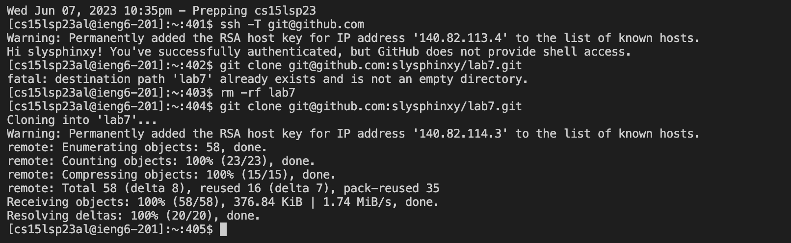

# Lab Report 4

## Step 4: Log into ieng6

I pressed ```<Command-C>``` and ```<Command-V>``` to copy the ```ssh cs15lsp23al@ieng6.ucsd.edu``` command, then to paste it into my terminal, then i pressed ```<enter>```
  


## Step 5: Clone your fork of the repository from your Github account

I pressed ```<Command-C>``` and ```<Command-V>``` to copy the ```ssh -T git@github.com``` command and paste it into my terminal, then I pressed ```<enter>``` I did this to check if I had a good connection to GitHub
  
Then I typed, ```git clone``` then pressed ```<Command-C>``` to copy the ssh link ```git@github.com:slysphinxy/lab7.git```, then ```<Command-V>``` to paste it into the terminal, then I pressed ```<enter>``` to clone the repository
  
The terminal prompted me that the lab already existed (from a previous attempt) so I typed 
the command ```rm -rf lab7``` and ```<enter>``` and that deleted it 

Then I typed, ```git clone``` then pressed ```<Command-C>``` to copy the ssh link ```git@github.com:slysphinxy/lab7.git```, then ```<Command-V>``` to paste it into the terminal, then I pressed ```<enter>``` again to clone the repository



## Step 6: Run the tests, demonstrating that they fail

I typed ```ls``` then ```<enter>``` to see the files, then I typed ```cd lab7``` , ```<enter>``` to change my directory, then I typed ```bash test.sh``` and ```<enter>``` to run the tests


## Step 7: Edit the code file to fix the failing test
Note: normal keys are bracketed because they are being used as VIM commands

Then I typed ```vim ListExamples.java``` ```<enter>``` to access the vim editor with this file

Then I typed ```</>``` and ```index1``` to find the first instance of “index1” in the file, then I typed ```<enter>```
Then I pressed ```<n>``` 1 time (since I was already near the bottom of the file) to get to the “index1” in the last loop and then I pressed ```<l>``` 5 times then I pressed ```<x>``` to delete the number 1 and  then pressed ```<i>``` and then 2 to change “index1” to “index2”

Then I pressed ```<esc>``` and ```<:>``` (```<shift>``` + ```<;>```) and ```w``` and ```q``` then ```<enter>``` to save and exit my changes


## Step 8: Run the tests, demonstrating that they now succeed

I pressed the ```<up>``` then ```<enter>``` to rerun the bash test.sh command from my terminal history and run the tests again to show that they work


## Step 9: Commit and push the resulting change to your Github account (you can pick any commit message!)

Then I typed ```git add ./ListExamples.java``` ```<enter>```, then ```git commit``` ```<->m``` and ```<”>``` with the message “```done```” then ```<”>``` to close it, this stages a commit with ```git add``` then it commits it with ```git commit``` so its ready to be pushed to main branch on my GitHub account

Finally I typed ```git push``` and ```<enter>``` which pushed it to my account on the main branch


