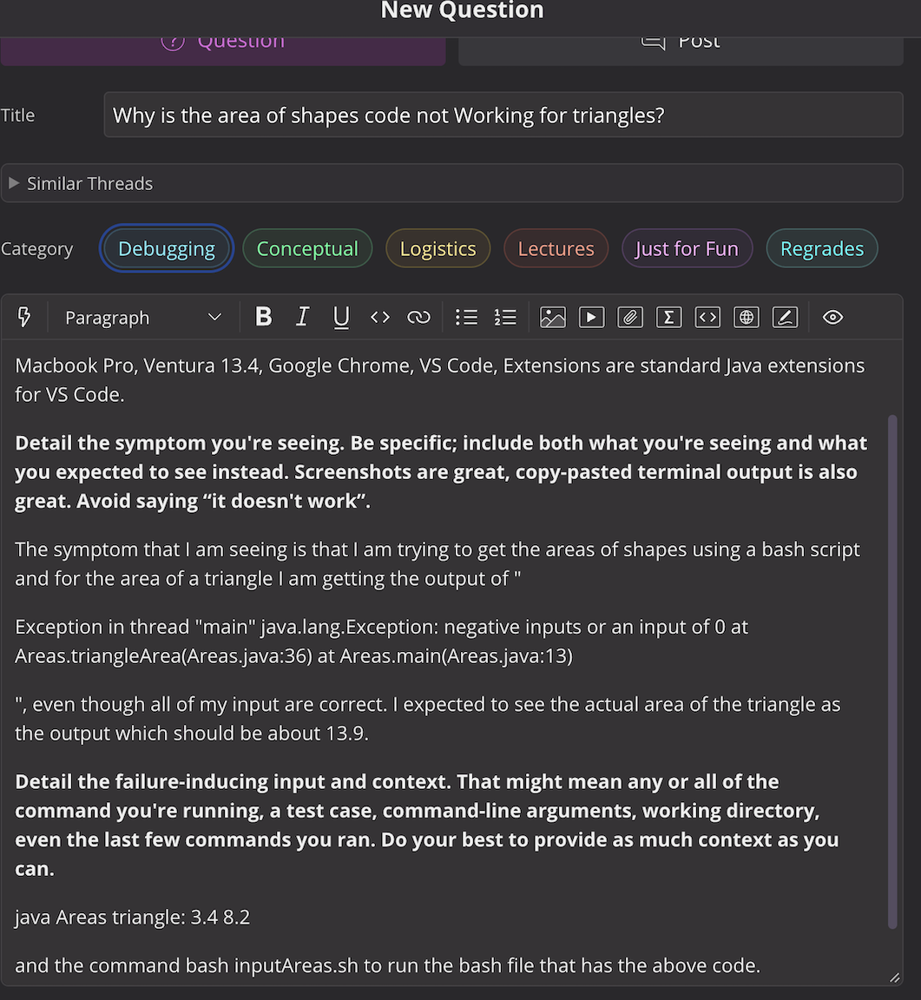

## Part 1 - Debugging Scenario

### 1. Screenshot of the Symptom


### 2. Screenshot of the Response


### 3. What information the Student Got from Response and What the Bug Is


The student was able to figure out based on the TA's response that the method for finding a triangle's area was buggy.
Looking into this method which is shown in the first screenshot, the student found that a part of the calculation for the area of a triangle used the fraction 1/2, this fraction rounded down to zero, therefore making it so the total area was zero because this fraction was multiplied by the base and height of the triangle. The second screenshot shows the result in the terminal after the code is fixed by changing the 1/2 to a .5, since .5 doesn't round down to zero, the multiplication gives the correct answer.

### 4. All the information

##### The directory structure (working directory): 

```/Users/matthewhoppe(me)/Desktop/Lab Report 5```, the files in this directory should be 
```Areas.java``` and ```inputAreas.sh```.

##### Contents of inputAreas.sh file:

```
javac Areas.java

java Areas circle: 1.5
java Areas rectangle: 2.5 7.9 
java Areas triangle: 3.4 8.2
```

##### Contents of Areas.java file:

```
class Areas{
    public static void main(String[] args) throws Exception{
        double one = Double.parseDouble(args[1]);
        if(args[0].equals("circle:")){
            System.out.println(Areas.circleArea(one));
        }
        if(args[0].equals("rectangle:")){
            double two = Double.parseDouble(args[2]);
            System.out.println(Areas.rectangleArea(one,two));
        }
        if(args[0].equals("triangle:")){
            double two = Double.parseDouble(args[2]);
            System.out.println(Areas.triangleArea(one,two));
        }
    }

    static double circleArea(double radius) throws Exception{
        double ans = 3.14*(radius)*(radius);
        if(ans <= 0){
            throw new Exception("negative inputs or an input of 0");
        }
        return ans;
    }

    static double rectangleArea(double length, double width) throws Exception{
        double ans = length*width;
        if(ans <= 0){
            throw new Exception("negative inputs or an input of 0");
        }
        return ans;
    }

    static double triangleArea(double base, double height) throws Exception{
        double ans = (1/2)*base*height;
        if(ans <= 0){
            throw new Exception("negative inputs or an input of 0");
        }
        return ans;
    }
}  
```

##### What commands to run for the bug:

```bash inputAreas.sh```

##### To fix the bug: 

Simply just change the ```(1/2)``` in the triangleArea method to a ```.5```, this fixes the error where the multiplication of the inputed ```base``` and ```height``` are multiplied by 1/2 (which evaluates to zero because of rounding) thus resulting in an area of zero. 

## Part 2 - Reflection

Something that I learned from my lab experience that I didn't know before was how to use VIM commands to quickly move around files. 
This is cool to me because I usually spend a lot of time clicking around and I am definantly faster with a keyboard, so using VIM
commands such as ```k``` and ```j``` to move up and down lines in a file has saved me a lot of time.
