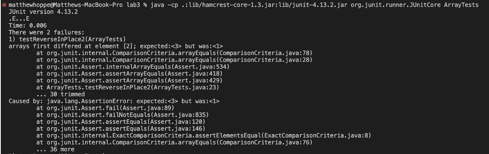

## Part 1 - Web Server


## Part 2 - Bugs in Method ReverseInPlace in ArrayExamples.java

A failiure inducing input and corresponding JUnit test:

```
@Test 
	public void testReverseInPlace2() {
    int[] input1 = { 3, 2, 1 };
    ArrayExamples.reverseInPlace(input1);
    assertArrayEquals(new int[]{ 1,2,3 }, input1);
	}
```

An input that does not induce failiure and its corresponding JUnit test:

```
@Test 
	public void testReverseInPlace() {
    int[] input1 = { 3 };
    ArrayExamples.reverseInPlace(input1);
    assertArrayEquals(new int[]{ 3 }, input1);
	}
```

The Symptom as the output of the test:



The bug before and after:
before:
```
static void reverseInPlace(int[] arr) {
    for(int i = 0; i < arr.length; i += 1) {
      arr[i] = arr[arr.length - i - 1];
    }
  }
```
after:
```
static void reverseInPlace(int[] arr) {
    for(int i = 0; i < arr.length/2; i += 1) {
      int temp = arr[i];
      arr[i] = arr[arr.length - i - 1];
      arr[arr.length - i - 1] = temp;
    }
  }
 ```
 This fix works because it makes it so that it only goes through the first half of the array therefore not switching
 twice and ovveriding the previous switch. Also, it uses a temp variable to store the data of the index being switched
 so that it is not just copied but actually switched.
 
 ## Part 3 - Reflection
 Something that I learned in lab 3 was how to use JUnit test. I didn't know the syntax that they used before and it was a bit different
 then what I had used in CSE 8B. I specifically learned about the @test syntax and how when checking doubles a delta value needs to be included.
