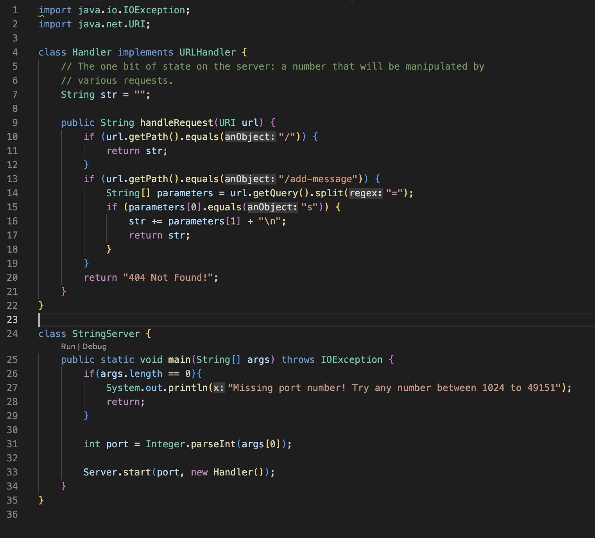
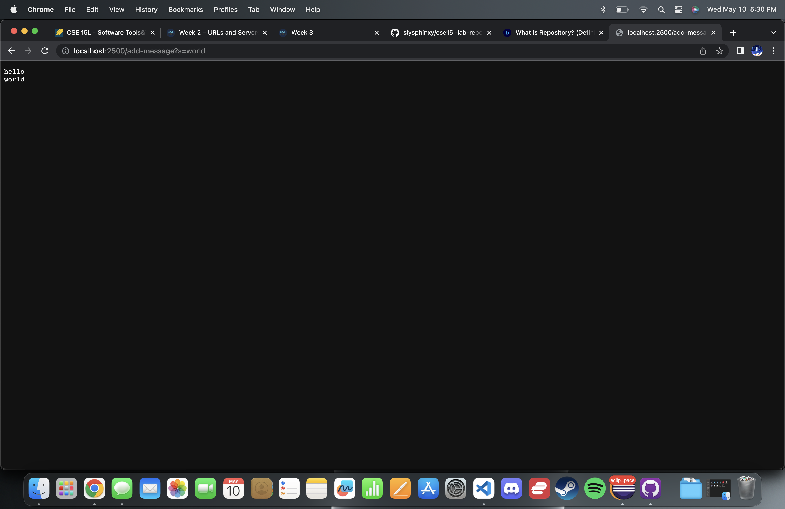

## Part 1 - Web Server

The code of my StringServer:

StringServer.java File:



Below are images of running the StringServer locally:


Above is an instance of the StringServer running for the first time. 
- medthods called: The method called in the StringServer.java file for this iteration is ```public String handleRequest(URI url)```.
- relevant arguments and fields for those methods: The ```handleRequest``` method takes the url [localhost:2000/add-message?s=hello]() as an argument. A relevant field is the ```String str``` field which before running stores the String ```""```. 
- relevant fields: The ```String str``` field changes its value from an empty string ```""``` to ```"hello"``` after running.



Above is an instance of the StringServer running for the second time.
- medthods called: The method called in the StringServer.java file for this iteration is ```public String handleRequest(URI url)```.
- relevant arguments for those methods: The ```handleRequest``` method takes the url [localhost:2000/add-message?s=world]() as an argument. A relevant field is the ```String str``` field which before running stores the String ```"hello"```.
- relevant fields: the ```String str``` field changes it value from ```"hello"``` to ```"hello\nworld"``` after running.

## Part 2 - Bugs in Method ReverseInPlace in ArrayExamples.java

A failiure inducing input and corresponding JUnit test:

```
@Test 
	public void testReverseInPlace2() {
	    int[] input1 = { 3, 2, 1 };
	    ArrayExamples.reverseInPlace(input1);
	    assertArrayEquals(new int[]{ 1,2,3 }, input1);
	}
```

An input that does not induce failiure and its corresponding JUnit test:

```
@Test 
	public void testReverseInPlace() {
	    int[] input1 = { 3 };
	    ArrayExamples.reverseInPlace(input1);
	    assertArrayEquals(new int[]{ 3 }, input1);
	}
```

The Symptom as the output of the test:


Explanation of the Symptom:
As seen in the image above, this symptom is that the third (last) element in the array is not what is expected. The test shows that the  
```int[] input1``` array that the method was used on has a value of 1 for the index ```[2]``` while the expected value at that index is 3. This symptom is caused because the method ```reverseInPlace``` did not swap the index ```[2]``` value with index ```[0]``` value like it was supposed to.

The bug before and after:

before:
```
static void reverseInPlace(int[] arr) {
    for(int i = 0; i < arr.length; i += 1) {
      	arr[i] = arr[arr.length - i - 1];
    }
  }
```
after:
```
static void reverseInPlace(int[] arr) {
    for(int i = 0; i < arr.length/2; i += 1) {
      int temp = arr[i];
      arr[i] = arr[arr.length - i - 1];
      arr[arr.length - i - 1] = temp;
    }
  }
 ```
 This fix works because it makes it so that it only goes through the first half of the array therefore not switching
 twice and ovveriding the previous switch. Also, it uses a temp variable to store the data of the index being switched
 so that it is not just copied but actually switched.
 
 ## Part 3 - Reflection
 
 Something that I learned in lab 3 was how to use JUnit test. I didn't know the syntax that they used before and it was a bit different
 then what I had used in CSE 8B. I specifically learned about the @test syntax and how when checking doubles a delta value needs to be included.
